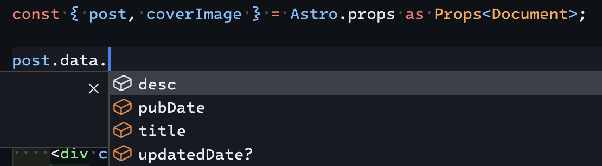

import Details from "@layouts/Details.astro";
// 必ずclientディレクティブを設定する
import Quiz from "@components/Quiz";

## 結論

### 方法1

`CollectionEntry`の型パラメーターをそのまま使います。

```ts:components/PostContent.astro
type Props<D extends keyof DataEntryMap> = {
    post: CollectionEntry<D>;
};

const { post } = Astro.props as Props<keyof DataEntryMap>;
```

### 方法2

受け取りたいコレクションの共通するフィールドで型を定義し、ジェネリックな`Props`で`extends`を指定します。

```typescript
type Document = {
    title: string;
    desc: string;
    pubDate: Date;
    updatedDate?: Date;
};

type Props<D extends Document> = {
    post: { data: D };
};

const { post } = Astro.props;
```

## 背景

ブログの記事とその他の投稿（プライバシーポリシーなど）のスキーマをそれぞれZodで定義しているのですが、どちらのコレクションも受け取れるコンポーネントを作りたいと思いました。

```ts:content.config.ts
import { defineCollection, z } from "astro:content";
import type { Document } from "@lib/types";
import { glob } from "astro/loaders";

const postsSchema = z.object({
    title: z.string(),
    desc: z.string(),
    pubDate: z.date(),
    updatedDate: z.date().optional(),
    tags: z.array(z.string()).optional(),
    pub: z.boolean().optional(),
    zenn: z.boolean().optional(),
});

const posts = defineCollection({
    loader: ...,
    schema: postsSchema,
});

const docsSchema = z.object({
    title: z.string(),
    desc: z.string(),
    pubDate: z.date(),
    updatedDate: z.date().optional(),
});
const docs = defineCollection({
    loader: ...,
    schema: docsSchema,
});

export const collections = { posts, docs };
```

## 実装

２つの方法を紹介します。方法2のほうが明示的で、メンテナンス性が高いと思います。

### 方法1

`CollectionEntry`の型パラメーターをそのまま使う方法です。通常は`CollectionEntry<"コレクション名">`として利用することが多いですが、`"コレクション名"`の部分をジェネリックにします。

```ts:components/PostContent.astro
type Props<D extends keyof DataEntryMap> = {
    post: CollectionEntry<D>;
};

const { post } = Astro.props as Props<keyof DataEntryMap>;
```
`extends keyof DataEntryMap`を指定しないとエラーになります。
`as Props<keyof DataEntryMap>`をつけることで、エディタの補完が効きます。`post.data.`と入力すると、存在するコレクションの共通するフィールドが候補として表示されます。よって、一部のコレクションにしか存在しないフィールドは補完に出ません。

### 方法2

受け取りたいコレクションの共通するフィールドで新しい型を定義します。

```ts:types.ts
export type Document = {
    title: string;
    desc: string;
    pubDate: Date;
    updatedDate?: Date;
};
```

`Props`をジェネリックにして、定義した型で制約をつけます。

```ts:components/PostContent.astro
type Props<D extends Document> = {
    post: { data: D };
};

const { post } = Astro.props as Props<Document>;
```

これで、このコンポーネント内で`Document`を満たす型を受け取ることができます。型が一致しない場合はエラーが出ます。`as Props<Document>`をつけることでエディタの補完が効きます。



これだけでも動きますが、`ZodObject`の定義時に型チェックをする方法があります。`satisfies`演算子を使います。

```ts:content.config.ts
const postsSchema = z.object({
    title: z.string(),
    desc: z.string(),
    pubDate: z.date(),
    updatedDate: z.date().optional(),
    tags: z.array(z.string()).optional(),
    pub: z.boolean().optional(),
    zenn: z.boolean().optional(),
}) satisfies z.ZodType<Document>;
```

## まとめ

AstroのPropsをジェネリックにして複数のコレクションを受け取る方法を紹介しました。
`CollectionEntry<"名前">`では特定のコレクションしか指定できませんが、`"名前"`の部分をジェネリックにしたり、共通するフィールドで型を定義することで、複数のコレクションを受け取ることができます。

## 参考

https://docs.astro.build/ja/reference/modules/astro-content/#collectionentry

https://zenn.dev/ynakamura/articles/65d58863563fbc

https://typescriptbook.jp/reference/values-types-variables/satisfies
