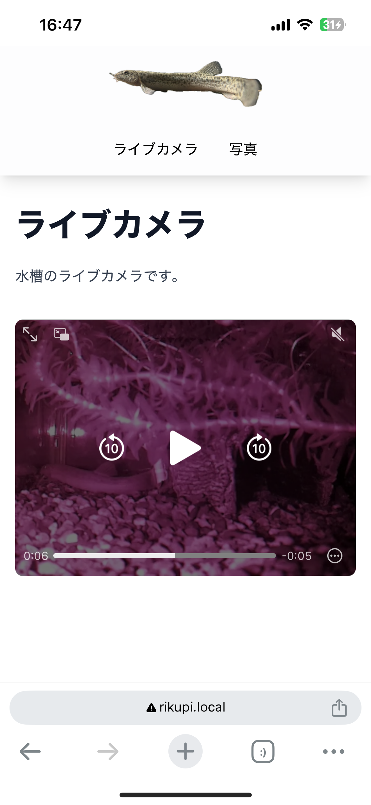
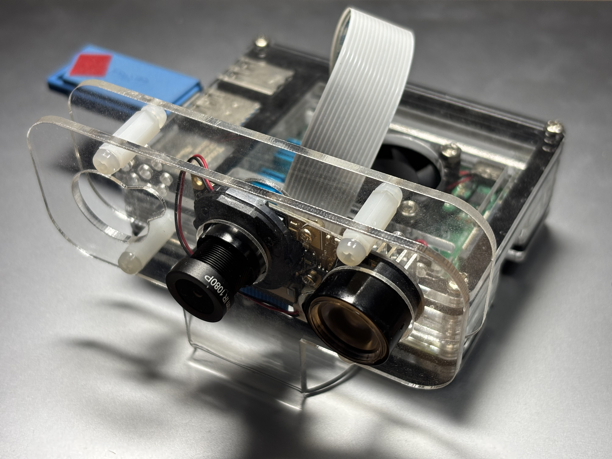

import Details from "../../layouts/Details.astro";

Raspberry Pi とカメラを活用した水槽監視システムを構築しました。水槽の前に立たなくても、Webブラウザから水槽の様子を確認できます。



すべてのコードは以下のリポジトリにあります。

https://github.com/pullriku/dojocam

## 背景

最近ドジョウを飼い始めたので、ドジョウちゃんは何してるかな？何してたかな？　と確認できるように、このシステムを作ってみました。

## 構成

シングルボードコンピューター「Raspberry Pi」にカメラを繋げて、水槽の隣に設置して使用します。



このカメラは赤外線LEDを搭載しており、暗い環境でも水槽の様子を撮影できます。LEDは2個付属していましたが、1個でも十分明るいです。

https://www.amazon.co.jp/dp/B0CD7KPH3K

このカメラから映像を取得し、リアルタイムの映像配信を行います。映像の配信にはHLS (HTTP Live Streaming) を利用します。さらに、1時間ごとに水槽のスナップショットを撮影し、履歴を記録する機能も実装しています。これにより、過去の水槽の様子を振り返ることができます。  
自宅ネットワーク内でのみ使用するため、セキュリティに関しては深くは考慮していません。

フロントエンドには[Astro](https://astro.build/)を使用し、バックエンドには[Rust](https://www.rust-lang.org/)言語のWebフレームワーク[Axum](https://github.com/tokio-rs/axum)を使用しています。

## 実装
### WebSocketサーバー

Webサーバーでは、現在接続中のクライアント数と、HLSストリームを配信するためのプロセスを管理します。
`rpicam-vid`コマンドでカメラからの映像を取得し、それを`ffmpeg`でHLSストリームに変換します。これにより、2つの`Child`を保持しています。

[`AtomicU32`](https://doc.rust-lang.org/std/sync/atomic/struct.AtomicU32.html)はスレッド間で安全に共有できる整数値で、Rustの原子性については[Rustonomiconのページ](https://doc.rust-lang.org/nomicon/atomics.html)で詳しく解説されています。

```rust:main.rs
static HLS_PROCESS: LazyLock<Mutex<Option<(process::Child, process::Child)>>> =
    LazyLock::new(|| Mutex::new(None));

static USERS: AtomicU32 = AtomicU32::new(0);
```

まず、WebSocketサーバーを起動し、接続数を追跡します。新しい接続があると、`USERS`をインクリメントし、HLSプロセスがまだ実行されていない場合は開始します。
```rust:main.rs
std::env::set_var("RUST_LOG", "info");
    env_logger::Builder::from_env("RUST_LOG")
        .format(|buf, record| {
            let level = record.level();
            let local = chrono::Local::now();
            let time = local.to_rfc3339();
            let target = record.target();
            writeln!(buf, "[{} {} {}] {}", time, level, target, record.args())
        })
        .init();

    let _ = std::fs::remove_dir_all("/tmp/dojocam");
    std::fs::create_dir_all("/tmp/dojocam").unwrap();
    let _ = std::fs::create_dir("images");

    tokio::spawn(websocket_server());
```
```rust:main.rs
async fn websocket_server() {
    info!("websocket server started");
    let server = TcpListener::bind((LOCALHOST, WEBSOCKET_PORT))
        .await
        .unwrap();
    while let Ok((socket, addr)) = server.accept().await {
        info!("user connected: {}", addr);
        tokio::spawn(async move {
            let mut websocket = tokio_tungstenite::accept_async(socket).await.unwrap();
            info!("websocket connected: {}", addr);

            USERS.fetch_add(1, std::sync::atomic::Ordering::SeqCst);
            if HLS_PROCESS.lock().await.is_none() {
                info!("start hls process");
                let child = start_hls();
                *HLS_PROCESS.lock().await = Some(child);
            }

            let start = tokio::time::Instant::now();
            while tokio::fs::metadata("/tmp/dojocam/stream.m3u8")
                .await
                .is_err()
            {
                if tokio::time::Instant::now() - start > std::time::Duration::from_secs(30) {
                    let _ = websocket
                        .send(tokio_tungstenite::tungstenite::Message::Text(
                            "timeout".into(),
                        ))
                        .await;

                    on_disconnected(addr).await;

                    return;
                }
                tokio::time::sleep(std::time::Duration::from_millis(100)).await;
            }

            let _ = websocket
                .send(tokio_tungstenite::tungstenite::Message::Text("OK".into()))
                .await;

            while (websocket.next().await).is_some() {}

            on_disconnected(addr).await;
        });
    }
}
```

### HLSストリームの生成
`start_hls`関数は、`rpicam-vid`と`ffmpeg`のプロセスを開始し、それらの`Child`を返します。コメントアウトしている場所は色々と試した跡です。`rpicam-vid`では、`--exposure`を指定して明るい映像を取得するようにしています。
`ffmpeg`で`-v:c copy`を指定すると、`rpicam-vid`の映像をそのまま流すようになりますが、通信負荷が高くなるため、エンコードの品質として`-preset medium` を指定し、ファイルサイズを抑えるようにしています。
```rust:main.rs
fn start_hls() -> (std::process::Child, std::process::Child) {
    let mut rpicam_vid = std::process::Command::new("rpicam-vid")
        .args([
            "-t",
            "0",
            "--exposure",
            "long",
            "--framerate",
            "20",
            // "--shutter",
            // "330000",
            // "--width",
            // "800",
            // "--height",
            // "600",
            "--denoise",
            "cdn_hq",
            "--nopreview",
            "--inline",
            "-o",
            "-",
        ])
        .stdout(std::process::Stdio::piped())
        .stderr(std::process::Stdio::null())
        .spawn()
        .unwrap();

    let ffmpeg = std::process::Command::new("ffmpeg")
        .args([
            "-i",
            "/dev/stdin",
            "-f",
            "hls",
            // "-c:v",
            // "copy",
            "-preset",
            "medium",
            "-hls_time",
            "4",
            "-hls_list_size",
            "5",
            "-hls_flags",
            "delete_segments",
            "-hls_segment_filename",
            "/tmp/dojocam/stream%05d.ts",
            "/tmp/dojocam/stream.m3u8",
        ])
        .stdin(rpicam_vid.stdout.take().unwrap())
        .stdout(std::process::Stdio::inherit())
        .stderr(std::process::Stdio::inherit())
        .spawn()
        .unwrap();

    (rpicam_vid, ffmpeg)
}
```
### ユーザーの切断処理
`on_disconnected`関数は、ユーザーが切断されたときに呼び出されます。ユーザーがいなくなった場合、HLSプロセスを停止します。`wait`を呼び出さないと、プロセスがゾンビプロセスとして残ります。詳細は[`std`のドキュメント](https://doc.rust-lang.org/std/process/struct.Child.html)に記述があります。
```rust:main.rs
async fn on_disconnected(addr: std::net::SocketAddr) {
    USERS.fetch_sub(1, std::sync::atomic::Ordering::SeqCst);
    info!(
        "user disconnected: {}, (count: {})",
        addr,
        USERS.load(std::sync::atomic::Ordering::SeqCst)
    );

    if USERS.load(std::sync::atomic::Ordering::SeqCst) == 0 {
        tokio::time::sleep(std::time::Duration::from_secs(10)).await;
        if USERS.load(std::sync::atomic::Ordering::SeqCst) != 0 {
            return;
        }

        info!("all users disconnected. kill rtsp process");
        if let Some(mut child) = HLS_PROCESS.lock().await.take() {
            child.0.kill().unwrap();
            child.1.kill().unwrap();
            child.0.wait().unwrap();
            child.1.wait().unwrap();
            let _ = tokio::fs::remove_file("/tmp/dojocam/stream.m3u8").await;
        }
    }
}
```

### HTTPサーバー
main関数の続きです。配信するディレクトリを設定します。`dist`にはAstroでビルドしたフロントエンドの成果物（HTMLなど）が入っています。`/tmp/dojocam`にはHLSストリームの成果物が入っています。`images`にはスナップショットが保存されます。

```rust:main.rs
info!("stream started");
let serve_dir = ServeDir::new("dist");
let serve_tmp = ServeDir::new("/tmp/dojocam").append_index_html_on_directories(false);
let serve_images = ServeDir::new("images").append_index_html_on_directories(false);
let app = axum::routing::Router::new()
    .nest_service("/stream", serve_tmp)
    .nest_service("/images", serve_images)
    .route("/api/images", axum::routing::get(image_names))
    .fallback_service(serve_dir)
    .layer(DefaultBodyLimit::max(50 * 1024 * 1024));

let listener = tokio::net::TcpListener::bind((LOCALHOST, HTTP_PORT))
    .await
    .unwrap();
axum::serve(listener, app).await.unwrap();
```

### スナップショットの撮影
スナップショットの撮影は、cronを使って1時間ごとに行います。まず撮影のためのスクリプトを作成します。`imagesディレクトリのパス`はimagesディレクトリの絶対パスです。何もしないと写真が無限に溜まり続けるため、手動で削除する必要があります。約1か月運用して123MBで、そこまで急速にストレージを圧迫するわけではないようです。
```sh
$ ls -l images/ | wc --lines
929
$ du -h images/
123M    images/
```

```sh
rpicam-jpeg -o /tmp/dojocam/image.jpeg --nopreview --width 800 --height 600 \
&& convert /tmp/dojocam/image.jpeg "imagesディレクトリのパス`date +%Y-%m-%dT%H:%M:%S`.webp" \
&& rm /tmp/dojocam/image.jpeg
```
`crontab`コマンドを使って、以下の設定を追加します。`スクリプトへのパス`はスクリプトの絶対パスです。この設定により、１時間毎に自動でスクリプトが実行され、新しい写真が撮影されます。ただし、カメラが使用中のときは撮影できません。

`crontab -e`として書き込むか、テキストファイルに書き込み、`crontab`コマンドで指定します。これはRaspberry Pi上で行います。
```sh
0 * * * * sh スクリプトへのパス
```

### スナップショットの配信
`image_names`関数は、`images`ディレクトリ内のファイル名を取得します。クライアントはこのエンドポイントを使用して、スナップショットのリストを取得できます。
```rust:main.rs
async fn image_names() -> Json<Vec<String>> {
    let mut names = std::fs::read_dir("images").unwrap().collect::<Vec<_>>();

    names.sort_by(|a, b| {
        a.as_ref()
            .unwrap()
            .metadata()
            .unwrap()
            .modified()
            .unwrap()
            .cmp(&b.as_ref().unwrap().metadata().unwrap().modified().unwrap())
    });

    let names: Vec<String> = names
        .into_iter()
        .map(|dir| {
            dir.unwrap()
                .path()
                .file_name()
                .unwrap()
                .to_str()
                .unwrap()
                .to_string()
        })
        .collect();
    Json(names)
}
```

### フロントエンド

#### ライブカメラのページ
ライブストリーミングを行うページです。このページではWebsocketパイプを繋ぎます。`Information`や`PaddingLayout`は別で定義してあるAstroのコンポーネントです。`hls.js`を使ってHLSストリームを再生します。サーバーの準備ができたら`OK`が送られてくるので、その後にHLSストリームを再生します。

```astro:index.astro
---
import Information from "../layouts/Information.astro";
import PaddingLayout from "../layouts/PaddingLayout.astro";

---

<PaddingLayout>
	<h1>ライブカメラ</h1>
	<p>水槽のライブカメラです。</p>
	<div id="information-container">
		<Information>
			<p class="text-center">
				システムを起動しています。お待ちください…（約12秒）
			</p>
		</Information>
	</div>
	<video muted autoplay controls class="hidden w-full justify-center rounded-lg"></video>
    <script>
		import Hls from "hls.js";

		const informationContainer = document.getElementById('information-container')!;

		const ws = new WebSocket(`ws://192.168.11.20:8000`);
		const start = new Date();
		let wsMessage = null;
		ws.onmessage = function (data) {
			wsMessage = data.data;
		}

		while (wsMessage !== "OK") {
			if (new Date().getTime() - start.getTime() > 30 * 1000) {
				informationContainer.textContent = "現在、カメラは利用できないかもしれません。再読み込みでもう一度試します。";
			}
			await new Promise(resolve => setTimeout(resolve, 100));
		}
		console.log("OK");
		const video = document.querySelector('video')!;
		if (Hls.isSupported()) {
			const hls = new Hls();
			hls.loadSource('/stream/stream.m3u8');
			hls.attachMedia(video);
		} else if (video.canPlayType('application/vnd.apple.mpegurl')) {
			video.src = './stream/stream.m3u8';
		}

		informationContainer.style.display = 'none';
		video.style.display = 'block';

		while (video.readyState <= 2) {
			await new Promise(resolve => setTimeout(resolve, 100));
		}
		video.play();
    </script>
</PaddingLayout>
```

#### 写真のページ
定期的に撮影している写真を表示するページです。`Layout`は別で定義してあるAstroのコンポーネントです。`image-container`に写真を表示します。`/api/images`から写真のリストを取得し、それを元に写真を表示します。

```astro
---
import Layout from "../layouts/Layout.astro";
---

<Layout>
    <h1>写真</h1>
    <p>定期的に撮影している写真です。</p>
    <div id="image-container" class="grid px-4 grid-cols-1 md:grid-cols-2 lg:grid-cols-3 2xl:grid-cols-4 gap-4 bg-slate-100 rounded-lg">
    </div>
    <script>
        const imageContainer = document.getElementById('image-container')!;

        const imageNames: Promise<string[]> = fetch("/api/images").then(res => res.json()).catch(err => console.error(err));

        imageNames.then(names => {
            names = names.sort().reverse();

            names.forEach(name => {
                const div = document.createElement('div');
                div.classList.add('flex', 'flex-col', 'items-center');

                const img = document.createElement('img');
                img.src = `/images/${name}`;
                img.alt = name;
                img.loading = 'lazy';
                img.onclick = () => window.open(`/images/${name}`);
                img.classList.add('rounded-lg', 'm-2', "hover:scale-105", "transition-transform");
                imageContainer.appendChild(img);
                
                const imageName = document.createElement('p');
                const [date, time_ext] = name.split('T');
                const time = time_ext.split('.')[0];
                imageName.textContent = `${date} ${time}`;
                
                div.appendChild(img);
                div.appendChild(imageName);
                imageContainer.appendChild(div);
            });
        });
    </script>
</Layout>
```

## デプロイ

デプロイ用のシェルスクリプトを作ります。
```sh:deploy.sh
rm -f dist.zip
zip dist.zip -r ./target/armv7-unknown-linux-musleabihf/release/dojocam-backend ./dist ./shot_image.sh
scp dist.zip RaspberryPi:~/projects/dojocam
```

`package.json`にビルド用・デプロイ用のコマンドを追加します。[`cargo-zigbuild`](https://github.com/rust-cross/cargo-zigbuild)は手軽にクロスコンパイルを行えて便利です。Zig言語のコンパイラを使ってコンパイルを行うようです。
```
"scripts": {
    "dev": "astro dev",
    "build": "astro build && cargo zigbuild --release --target armv7-unknown-linux-musleabihf",
    "deploy": "yarn build && sh deploy.sh",
    "preview": "astro preview",
    "astro": "astro"
},
```

## 起動

デプロイをおわらせた後にRaspberry PiへSSHでログインし、プロジェクトに`cd`して、`./target/armv7-unknown-linux-musleabihf/release/dojocam-backend`を実行すれば、サーバーが起動します。初回のみ`crontab`の設定が必要です。

## まとめ
このシステムでは、Raspberry Piによる水槽の監視を実現できました。WebサーバーはRust言語とAxum、フロントエンド側はAstroを使用しています。WebサーバーでHLSストリームを配信して、フロントエンドで再生することができます。WebSocketを使って、接続されているのかを把握しています。また、1時間ごとにcronでスナップショットを撮影し、その写真を配信しています。

## 写真を見ると……

定期的に撮影した写真を見ると、ドジョウちゃんの動きを確認することができます。ドジョウちゃんはたまに数時間じっとしているようです。寝ているのでしょうか？　朝6時、7時あたりから10時頃、もしくはお昼まであまり動かないこともあるようです。じっとしているかは写真上での位置と水槽の底砂の形状が変わったかで判断しています。
