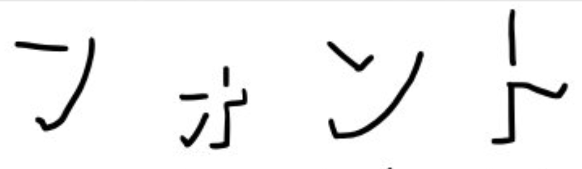
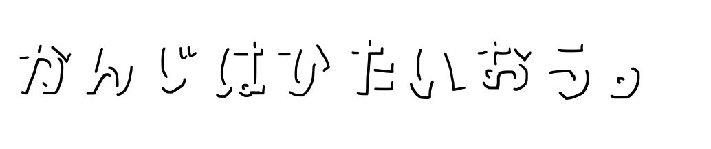

import Details from "@layouts/Details.astro";
import X from "@components/XEmbed.astro";
import Quiz from "@components/Quiz";

下の画像のように、文字の影部分のみを残した画像を用意する。私達人間は多分読めると思うが[^1]、LLMは文字を認識してくれるのか、試してみた。

定量的な評価方法が思いつかないため、今回は結果を眺めるにとどめる。

[^1]: 全員認識できるのか、どれくらいの割合で認識できるのかは知らない。




## 背景

ばっと but さんが作成された、ブラウザ上で手書きによるフォント制作ができるツールで影文字フォントを作った。

<X url="https://x.com/pullriku/status/1943066411250921834" />

影しか描いていないため、なんとなく「LLMは認識できないだろうな」と思いながらChatGPTに送りつけてみたら、少しは読めているっぽいことに気づき、各LLMで比較することにした。

## 検証

検証は2025年7月12日の14:50〜16:30に実施した。ChatGPTは設定の「保存されたメモリを参照する」を無効にした状態にした。プロンプトは、「この画像のテキストをそのまま書き起こしてください。」とした。

### 「かんじはひたいおう。」での検証

まず、ツイートに載せた画像の一部分を切り取って各LLMに送りつけた。




### 少し長いテキストでの検証

次に、ひらがな・アルファベット・数字を混ぜた文字列での検証を行った。


## 結果

### 「かんじはひたいおう。」での検証

結果は以下のようになった。

| LLM | 認識した文字列 |
| --- | --- |
| ChatGPT(GPT-4o) | かんじ（はりたいおう） |
| ChatGPT(GPT-4.1) | かんじ（はんだいおう）|
| ChatGPT(o4-mini) | がんじでんたいおうコン |
| ChatGPT(o4-mini-high) | かんじたいおうご |
| ChatGPT(o3) | がんじ（ばりだいおう） |
| Gemini(2.5 Flash) | だんじょりょくでいきいき |
| Gemini(2.5 Pro) | マ゛ตรฐาน゛て゛はないて゛すぅ、、 |
| Claude(Sonnet 4) | が外とほりたい教う。 |
| Grok(3) | かんじ むず かっこう |


ChatGPT(GPT-4o)は「かんじは」「たいおう」を認識できている。「は」の左側の棒を括弧として認識してしまった。惜しい。4.1、o3も健闘している。
Claudeは「か」と「たい」「う」を認識できた。Grokは「かんじ」を認識できた。
一方Geminiは謎の文字列を出力した。

ChatGPTはかなり精度が良いように思える。

### 少し長いテキストでの検証

- ChatGPT(GPT-4o)
```
1 きょうは sunny で おんどは 25どくらい  
tshirt が ちょうどいいね。  

2 さっきから じぶんごとに alarm が beep beep  
ってなるのが へんだよ。  

3 wicchiShi は ねこが すきで みんな すごく  
cute なんだ。  

4 あしたの plan は 10じに cafe で meeting して  
から かえろう。  

5 その box に 7こぶんの snack と pen を いれて  
おいてね。  
```

ところどころ間違えつつも、大体は合っている。

- ChatGPT(GPT-4.1)
```
1　きょうはSunnyできおんは25どくらい
　　Tshirtがちょうどいいね。

2　さっきから15ふんごとにalarmがbeep beep
　　ってなるのがへんだよ。

3　WCHISHIはねこがさびきいて、みんなすごく
　　cuteなんだ。

4　あしたのplanは10じにcafeでmeetingして
　　からかえろう。

5　そのboxに7こぶんのsnackとpenをいれて
　　おいてね。
```
良い感じ。

- ChatGPT(o4-mini)
```
1. きょうこんな sunny で きおんは25どくらいし、
   T-Shirt がちょうどいいね。
2. さっきから1ぷんごとにalarmがbeep beepってなるのがへんだよ。
3. watchOSはねこがこびきいて、みんなすごくcuteなんだ。
4. あしたのplanは10じにcafeでmeetingしてからかえろう。
5. このboxに7こぶんのsnackとpenをいれておいてね。
```

- ChatGPT(o4-mini-high)
```
1　きょうは sunny で きおんは 25どくらいし  
-[shirt]- がちょうどいいね。

2　さっきから1ぷんごとに alarm が beep beep  
ってなるのがへんだよ。

3　switchはねこがこびきいて、  
みんなすごくcuteなんだ。

4　あしたの plan は10じに cafe で meetingして  
から、かえろう。

5　その box に7こぶんの snack と pen をいれて  
おいてね。
```

- ChatGPT(o3)
```
1 きょうは sunny で きおんは 25どくらいで
- tShirt が ちょうどいいね。

2 さっきから じぶんごとに alarm が beep beep
ってなるのが へんだよ。

3 wycI-tcIShi (は ねこが さびきいて みんな すごく
cute なんだ。

4 あしたの plan は 10じ に cafe で meeting して
から かえろう。

5 その box に 7こぶん の snack と pen を いれて
おいてね。
```
思考時間10分超え。長い。

- Gemini(2.5 Flash)
```
1 きょうはsunnyできおんは25どくらい、 tshirtがちょうどいいいね。
2 さっきから1ぷんごとにalarmがbeep beepってなるのがへんじょ。
3 watashiはねこが5びきいて、みんなすごくcuteなんじょ。
4 あしたのplanは10じにcafeでmeetingしてからかえろう
5 そのboxに3こぶんのsnackとpenをいれておいてね。
```

- Gemini(2.5 Pro)
```
１ きょうは sunny で きおん は 25どくらい、tshirt が ちょうどいいね。
２ さっきから １ぷんごとに alarm が beep beep ってなるのが へんだよ。
３ watashi は ねこが ３びきいて、みんな すごく cute なんだ。
４ あしたの plan は 10じに cafe で meeting してからかえろう。
５ その box に べんとうの snack と pen を いれておいてね。
```
「べんとう」だけ間違い。

- Claude(Sonnet 4)
```
1 きょうは sunny できなかった 25 どくちいん
  tshirt が ちょっと しいい被り
2 きっきから 4 桃 かべとに glicrm が beep beep
  っでき う のが へりょう
3 wcitclsn は ねうが こびきいてへ みかき すごく
  cute きんょう
4 新しいの picrn は 10 じに cafe で meeting して
  から かえろう
5 この OCX とフこんのの snack と pen きいれて
  おいてねう
```
だめ。

- Grok(3)
```
1. きょうは Sunny で きおんは 25ど くらい
tShirt で ちょうどいいね
2. さっきから 1ぷんごとに えいrん が べっぺっぺ
ってるのが へんてこ
3. wちtぷhi ね ねが 3びきいて みゅずすごく
cute なんぽ
4. あしたの plcin 11じに そfで てmeetingして
から かえろっ
5. そ の ぴX ぉ り2ぶん の Snぇk と peん き いれて
おいてね
```
だめ。


## 文字の大きさに関する考察

「かんじはひたいおう。」で惨敗したGeminiが、長いテキストで好成績を残した。文字が多くなり、文字サイズが小さくなったことで読みやすくなったのかもしれない。

試しに、「かんじはひたいおう。」を小さくしてGemini 2.5 Proに与えると、見事に正解した。ChatGPT 4oやo4-miniもいい線を行っている。Claude Sonnet 4とGrok 3は滅茶苦茶な文字列を出力した。


不完全な文字は小さくすると認識の精度が上がったりするのかな？　と思った。

## まとめ

各LLMで影文字の認識精度に差があることが確認できた。
特に ChatGPT 系は全体的に高い精度を示した。
一方、Gemini 系は文字サイズが小さい場合に精度が向上する傾向が見られた。

<Quiz
  question="唯一、「watashi」を認識できたのはどのモデル？"
  answers={["ChatGPT", "Gemini", "Claude", "Grok"]}
  correctAnswer={"Gemini"}
  client:visible
>
Geminiは[少し長いテキストでの検証](#少し長いテキストでの検証-1)にて、「watashi」を認識できた。
</Quiz>

