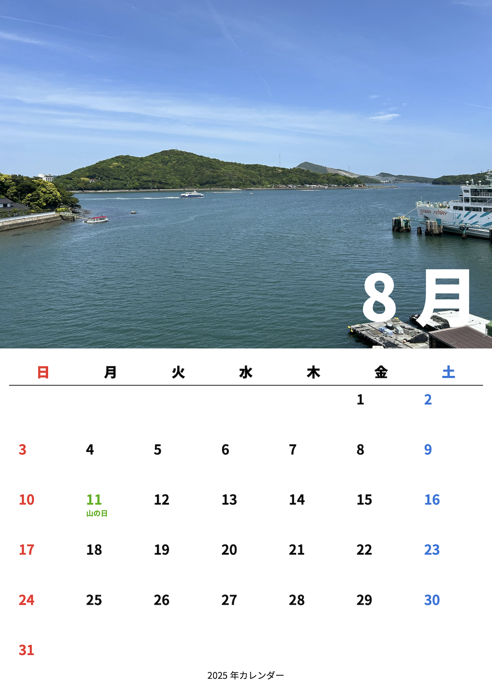
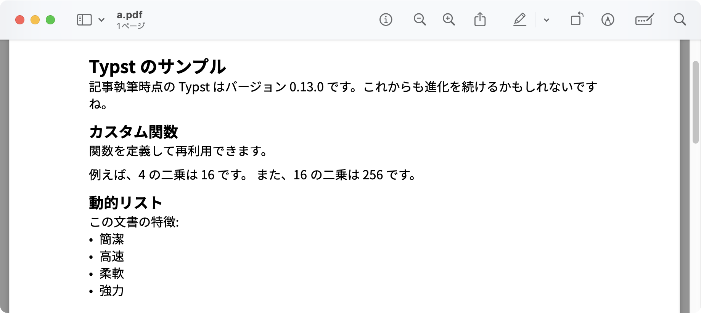

import Details from "@layouts/Details.astro";
// 必ずclientディレクティブを設定する
import Quiz from "@components/Quiz";

## はじめに

Typst の各種機能（日時計算、グリッドレイアウト、画像の配置、外部データの取り込みなど）を組み合わせ、ユーザーが任意の画像を選択できるカレンダーを作成しました。この記事では、その仕組みについて解説します。

本記事で取り上げるコードは、以下のGitHubリポジトリで公開しています。

https://github.com/pullriku/typst-simple-calendar

<Details title="ビルド方法について">
このリポジトリをクローンして、`examples`ディレクトリの中にある使用例をビルドできます。直接`typst`コマンドを使う際は、`--root .`オプションを指定してください。`examples`ディレクトリには`cd`せずに実行してください。

また、`Justfile`というファイルを用意してあります。GNU Makeっぽいコマンドランナー[`just`](https://github.com/casey/just)を導入すると、

```sh
just all
```

とか、

```sh
just calendar1
```

とかを実行することで、簡単にビルドできます。`just --list`で実行できるタスクの一覧を見ることができます。全部ビルドするなら`just all`です。

`just all`を実行すると、`projects.just`というファイルができます。オリジナルのカレンダーを作る際には、このファイルにビルドコマンドを書くと便利です。以下は私の例です。

```just
import "./dirs.just"

all-projects: cal2025

cal2025: dist projects
    typst compile {{typst_flags}} projects/cal2025/cal2025.typ dist/projects/cal2025.pdf
```

成果物用のディレクトリ`dist/projects`を作成するためのタスクを呼び、コンパイルを行います。`all-projects`に全てのプロジェクトのタスクを書いておきます。執筆時は`just 1.39.0`です。

</Details>

完成品はこのようになります。



## Typstについて

Typstは、シンプルで直感的な記法を特徴とする文書組版システムです。LaTeXのように高度な数式や構造化文書を作成できる一方で、より簡潔な構文と高速なコンパイルを実現しています。Markdownの手軽さとLaTeXの表現力を兼ね備えています。

Typstでは、関数や変数を用いて文書を柔軟にカスタマイズすることも可能です。以下のコードは、変数を用いて動的に文書を構築し、関数を定義して再利用する例です。

```typst
#set text(font: "Noto Sans JP")
= Typstのサンプル

// 変数の定義
#let name = "Typst"
#let version = "0.13.0"

記事執筆時点の #name はバージョン #version です。これからも進化を続けるかもしれないですね。

== カスタム関数
関数を定義して再利用できます。

#let square(x) = x * x

例えば、4の二乗は #square(4) です。
また、16の二乗は #square(16) です。

== 動的リスト
#let items = ("簡潔", "高速", "柔軟")
#items.push("強力")

この文書の特徴:
#for item in items [
  - #item
]
```

これをコンパイルすると、以下のような文書が生成されます。



## 必要なもの

- **Typst**
  執筆時は`Typst 0.13.0`です。

https://github.com/typst/typst

https://typst.app/

- **データファイル**
  祝日情報は、e-govデータポータルにある`syukujitsu.csv`を利用します。この記事の最後に参考リンクを掲載しています。

- **画像ファイル**  
  カレンダーに表示する月ごとの画像を12枚用意しておきます。

## カレンダー作成の概要

本実装を大まかなステップに分けると、以下のようになります。

1. **祝日データの読み込み**  
   CSV ファイルから祝日情報を辞書として読み込む。

2. **表の作成**  
   指定された年月のすべての日付をグリッド上に配置し、各セルに日付や祝日情報を表示する。曜日ごとの色分けを行う。

3. **月カレンダー全体の生成**  
   背景画像、月カレンダーの表、月名・タイトル表示を組み合わせる。

4. **画像レイアウト関数**  
   1枚、2枚、4枚の画像をグリッド状に配置するための補助関数群により、画像の配置を簡単に行う。

5. **年カレンダーの組み立て**  
   各月ごとにカレンダーを生成し、ページ単位で出力する処理。画像の選択やフォント、マージン（余白）の設定を行う。

以下、各コードブロックの実装と設計思想について、順を追って解説していきます。
なお、コード内でパスを記述している箇所があります。ルート(`/`)は**ワークスペースの**ルートディレクトリを指します。

---

## 1. 祝日データの読み込み

まずは、祝日データを外部 CSV から読み込み、後のカレンダー作成で利用するための辞書を生成します。

```typst
#let read_syukujitsu_csv() = {
  let csv = csv("/syukujitsu.csv")
  let result = (:)
  for row in csv {
    result.insert(row.at(0), row.at(1))
  }
  result
}
```

### 解説

- **CSVファイルの読み込み**  
  `csv("/syukujitsu.csv")` により、CSV ファイルの内容を読み込みます。各行は日付と祝日名のペアになっている前提です。[参考](#参考)にある`syukujitsu.csv`は以下のようなフォーマットになっています。

  ```csv
  2025/1/1,元日
  2025/1/13,成人の日
  2025/2/11,建国記念の日
  ```

- **辞書（マップ）の生成**  
  `let result = (:)` で空の辞書を作成し、各行のデータをキー（日付）と値（祝日名）として登録していきます。

- **ループ処理**  
  `for row in csv { … }` で CSV の各行に対して処理を行い、`row.at(0)` と `row.at(1)` でそれぞれの値を抽出し、`insert()` 関数で辞書に格納します。

- **結果を返す**
  最終的に作成された辞書を返し、後続のカレンダー作成処理で祝日情報の参照に利用します。

## 2. 月カレンダーのテーブル作成

次に、指定した年月のカレンダー表（テーブル）を生成する関数です。

```typst
#let month_calendar_table(
  year, month, holiday_data: (:), weekday_names: default_weekday_names,
) = {
  let month_day_1 = datetime(
    year: year,
    month: month,
    day: 1,
  )

  let days = range(0, 31)
    .map(day => month_day_1 + duration(days: day))
    .filter(day => day.month() == month)

  let first_day_padding = calc.rem-euclid(
    int(days.first().display("[weekday repr:monday]")),
    7
  )

  let cal_grid = grid(
    columns: (1fr,) * 7,
    rows: (3em,) + (1fr,) * 6,
    inset: 1em,
    ..weekday_names.map(name => {
      // 曜日の名前の色分け
      let color = if name == weekday_names.at(0) {
        // 日曜日は赤
        red
      } else if name == weekday_names.at(6) {
        // 土曜日は青
        blue
      } else {
        black
      }
      let weekday_name = place(top + center)[
        #text(name, fill: color, size: 1.5em, weight: "black")
      ]
      grid.cell(weekday_name, stroke: (bottom: 1pt))
    }),
    ..(([], ) * first_day_padding),
    ..days.map(day => {
      // 日付を文字列としてフォーマットし、祝日データを参照
      let holiday_name = holiday_data.at(day.display("[year]/[month padding:none]/[day padding:none]"), default: "")
      let holiday_name =  if holiday_name == "" {
        holiday_data.at(day.display("[year]-[month padding:none]-[day padding:none]"), default: "")
      } else {
        holiday_name
      }

      // 日付の色分け
      let color = if holiday_name != "" {
        rgb("#00B000")
      } else if day.weekday() == 6 {
        blue
      } else if day.weekday() == 7 {
        red
      } else {
        black
      }
      let day_num = day.display("[day padding:none]")
      place(top + left)[
        #text(fill: color, size: 2em, weight: "bold")[
          #day_num
        ]
        #linebreak()
        #text(fill: color, size: 0.8em, weight: "bold")[
          #holiday_name
        ]
      ]
    })
  )

  let rect = rect(inset: 0.5pt, radius: 10pt, fill: rgb(255, 255, 255, 80%),)[
    #cal_grid
  ]

  rect
}
```

### 解説

- **日付リストの生成**
  - `month_day_1` でその月の 1 日を生成します。
  - `range(0, 31)` を用いて連続した日付を生成し、フィルタで該当月のみに絞り込みます。2025年の2月なら、1日から28日までの日付が生成されます。
    この部分は`october`というライブラリのコードを参考にしました。

https://typst.app/universe/package/october/

- **グリッドのパディング**  
  月初日の曜日を取得し、必要な空セル数を `calc.rem-euclid()` で計算します。これにより、正しい曜日位置に日付が配置されます。

- **グリッドの作成**  
  `grid()` 関数で 7 列・7 行（曜日行＋6行の日付）のレイアウトを構築します。  
  曜日名のセルは、曜日ごとに色分け（日曜：赤、土曜：青、それ以外：黒）して配置します。
  日付セルは、日付と祝日名を表示し、祝日データがある場合は緑色で表示します。土曜日と日曜日も色分けしています。

- **囲い込み**  
  `rect()` 関数でグリッド全体を角丸の矩形で囲み、背景色（透過付き）を設定して見た目を整えています。背景画像を設定すると、半透明に見えます。

- **日付の処理**
  `datetime`型の`display`メソッドでは、フォーマットを指定して文字列を生成することができます。

https://typst.app/docs/reference/foundations/datetime/#format

## 3. 月カレンダー全体の生成

カレンダー表と、背景画像・月名・タイトル表示を組み合わせ、月カレンダーを作成する関数です。

```typst
#let month_calendar(year, month, image, title: "[year] Calendar", holiday_data: (:), weekday_names: default_weekday_names, month_format: "[month repr:long]") = {
  let month_datetime = datetime(year: year, month: month, day: 1)

  box(clip: true)[
    #image
  ]

  place(top)[
    #box(height: 50%, width: 100%)[
      #place(bottom + right, dy: -3em, dx: -2em)[
        #text(size: 7em, weight: "black", fill: white)[#month_datetime.display(month_format)]
      ]
    ]
  ]

  place(bottom)[
    #box(height: 50%, width: 100%)[
      #place(top + left)[
        #pad(1em)[
          #month_calendar_table(year, month, holiday_data: holiday_data, weekday_names: weekday_names)
        ]
      ]
    ]
  ]

  place(bottom + center, dy: -2em)[
    #text()[
      #datetime(year: year, month: month, day: 1).display(title)
    ]
  ]
}
```

### 解説

- **背景画像の設定**  
  `box(clip: true)` を利用して、指定した画像をコンテナ内にクリッピングし、余計なはみ出しを防止しています。

- **月名の表示**
  - `place` を使い、上部に月名を表示する領域を作成し、この領域の右下に月名を表示します。

- **カレンダー表の配置**
  - `place` を使い、下部にカレンダー表を配置します。`month_calendar_table()` でカレンダー表を生成し、`pad()` で余白を設定しています。
  - `place` を使い、下部にカレンダー名を表示します。（例：2025年カレンダー）

## 4. 画像レイアウト関数

カレンダー内で使う画像を、用途に応じて 1 枚、2 枚、4 枚配置するための関数群です。カレンダーを作る際は、これらを使って画像の配置を設定します。

```typst
#let quadruple_image(path1, path2, path3, path4) = {
  grid(
    columns: (1fr, 1fr),
    rows: (1fr, 1fr),
    image(path1, width: 100%, height: 100%, fit: "cover"),
    image(path2, width: 100%, height: 100%, fit: "cover"),
    image(path3, width: 100%, height: 100%, fit: "cover"),
    image(path4, width: 100%, height: 100%, fit: "cover"),
  )
}

#let double_image(path1, path2) = {
  grid(
    columns: (1fr, 1fr),
    image(path1, width: 100%, height: 100%, fit: "cover"),
    image(path2, width: 100%, height: 100%, fit: "cover"),
  )
}

#let single_image(path) = {
    image(path, width: 100%, height: 100%, fit: "cover")
}

#let half_area(grid) = {
  box(height: 50%)[
    #grid
  ]
}

#let full_area(grid) = {
  box(height: 100%)[
    #grid
  ]
}
```

### 解説

- **グリッドレイアウトの活用**
  - `quadruple_image` は 2×2 のグリッドで 4 枚の画像を均等に配置します。
  - `double_image` は横並びに 2 枚の画像を配置します。
  - `single_image` は単体の画像を、コンテナ全体にフィットするように表示します。

- **表示する領域**
  - `half_area` はページの 50% に画像を表示します。
  - `full_area` はページ全体に画像を表示します。すなわち、表の部分にも画像が表示されます。臨場感、迫力を出す場合はこちらです。

- **画像のフィッティング**  
  各画像には `fit: "cover"` を指定することで、アスペクト比を維持しつつ、コンテナ全体を覆うように拡大縮小されます。

## 5. 年カレンダーの生成

最後に、1 年間のカレンダーを生成するための関数です。各月ごとに `month_calendar()` を呼び出し、画像やフォント、ページレイアウトを設定します。

```typst
#let year_calendar(
  year,
  months: range(1, 12 + 1),
  font: "",
  images: (),
  weekday_names: default_weekday_names,
  holiday_data: read_syukujitsu_csv(),
  title: "[year] Calendar",
  month_names: range(1, 12 + 1).map(month => datetime(year: 0, month: month, day: 1).display("[month repr:long]")),
) = [
  #set text(font: font)
  #set page(margin: 0pt)
  #show box: it => align(it, center)

  #for month in months [
    #month_calendar(year, month, images.at(month - 1, default: half_area(single_image("/1.jpeg"))), holiday_data: holiday_data, weekday_names: weekday_names, title: title, month_format: month_names.at(month - 1, default: "[month repr:long]"))

    #pagebreak(weak: true)
  ]
]
```

### 解説

- **グローバル設定**
  - `#set text(font: font)` でカレンダー全体のフォントを指定。
  - `#set page(margin: 0pt)` により、ページ余白を取り除いて最大限のレイアウトスペースを確保します。
  - `#show box: it => align(it, center)` を用いて、全てのボックス要素を中央揃えに統一しています。

- **月ごとの生成とページ区切り**  
  `#for month in months` により、1 月から 12 月までの各月に対してカレンダーを生成し、画像が指定されていない場合はデフォルト画像 `/1.jpeg` を利用します。  
  また、各月ごとに `#pagebreak(weak: true)` を挿入し、印刷やPDF出力時に各月が別ページになるように設計しています。

もし、画像が12枚未満しか入力されない場合は、デフォルトの画像が勝手に挿入されます。

## カスタマイズのポイント

- **祝日データの拡張**  
  CSV ファイルのフォーマットや取り込み方法を変更することで、地域ごとの祝日や特定イベントの記載も可能です。

- **画像の差し替え**
  `year_calendar` の `images` 引数に、各月の画像パスを指定することで、カレンダーに好みの画像を表示できます。

- **カレンダーのレイアウト**
  `images`引数に[レイアウト関数](#4-画像レイアウト関数)を指定することで、画像の配置を変更できます。今のところは分割したりエリアを変えたりしかできないため、もう少し自由度を上げたいとは思っています。

- **フォントの変更**
  `year_calendar` の `font` 引数にフォント名を指定することで、カレンダー全体のフォントを変更できます。

- **ページサイズの変更**
  `year_calendar`などの巻数を使う前に`#set page(size: "A4")` などでページサイズを変更しておくことで、印刷時の出力サイズを調整できます。

- **タイトルの変更**
  ページの下の方に出るタイトルを変更できます。

- **英語化・日本語化**
  デフォルトの月名と曜日名は英語にしてあります。`month_calendar`や`year_calendar`の引数で日本語に変更することもできます。
  ```typst
  // ...
  month_names: range(1, 12 + 1).map(month => str(month) + "月"),
  weekday_names: ([日], [月], [火], [水], [木], [金], [土]),
  // ...
  ```

Typstのカスタマイズは奥が深そうで、どのへんまで関数の引数で公開するか、`#set`を使うようにするかは手探りです。

## 実際にカレンダーを生成する

実際にカレンダーを生成してみます。リポジトリ内に用意している使用例（`examples/calendar2/calendar2.typ`）です。

```typst
#import "/src/lib.typ" as lib: full_area, half_area, single_image, double_image, quadruple_image

#set page(margin: 0pt)

#let lake = "/examples/calendar2/images/lake.jpeg"
#let sunset = "/examples/calendar2/images/sunset.jpeg"

#lib.year_calendar(
  2025,
  font: "Noto Sans JP",
  images: (
    half_area(single_image(lake)),
    full_area(single_image(sunset)),
    half_area(double_image(lake, sunset)),
    full_area(double_image(lake, sunset)),
    half_area(quadruple_image(lake, sunset, lake, sunset)),
    full_area(quadruple_image(lake, sunset, lake, sunset)),
  ),
)

```

以下のように表示されます。

- 1月は上半分に湖の画像がひとつ
- 2月は全面に夕焼けの画像がひとつ
- 3月は上半分の左に湖の画像、右に夕焼けの画像
- 4月は全面の左に湖の画像、右に夕焼けの画像
- 5月は上半分に湖と夕焼けの画像が4つ
- 6月は全面に湖と夕焼けの画像が4つ

7月以降は指定していないため、デフォルトの画像が挿入されます。

## まとめ

本記事では、Typst を活用して、カレンダーを作成する方法について解説しました。

文書だけじゃなく、カレンダーも作れるとは思いませんでした。（やってみたらできた）

<Quiz
  question="TypstのCodeモードにおいて、code blockは{}で表現しますが、content blockは何で表現するでしょう？"
  answers={["{}", "[]", "()", "<>", "#関数名()[]"]}
  correctAnswer={["[]"]}
  client:visible
>
Typstの構文解析には3つのモードがあり、それぞれCode、Math、Markupと呼ばれています。最初はドキュメントのためのMarkupから始まり、`#`の出現でCodeに、`$`の出現でMathに切り替わります。Codeモードで`[]`を使うことで、contentを表現できます。
```typst
#let my_content = [Hello, world!]
#let say(content) = {
  [I say "#content"]
}

#say(my_content)

````
出力:
```txt
I say "Hello, world!"
````

参照: https://typst.app/docs/reference/syntax/#modes

</Quiz>

## 参考

e-gov データポータルの[昭和30年（1955年）から令和2年（2020年）国民の祝日等（いわゆる振替休日等を含む）（csv形式：19KB）](https://data.e-gov.go.jp/data/dataset/cao_20190522_0002/resource/d9ad35a5-6c9c-4127-bdbe-aa138fdffe42)(`syukujitsu.csv`)は[CC BY ライセンス](https://creativecommons.org/licenses/by/4.0/)で公開されています。
